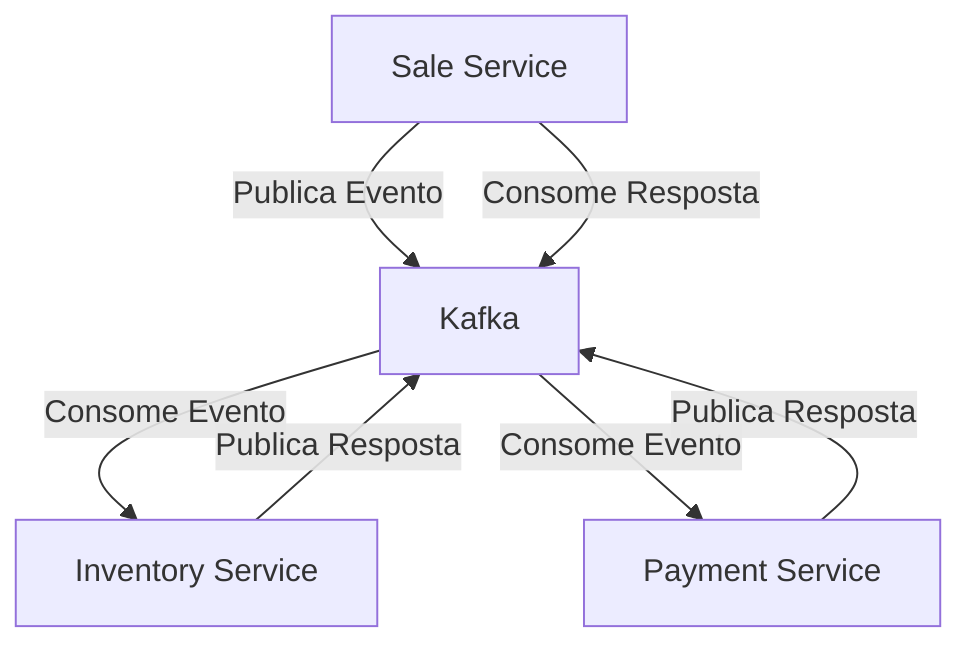
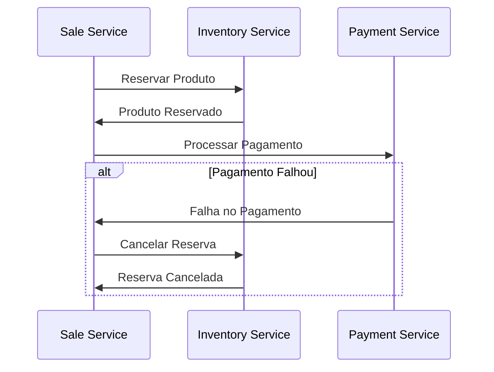

# MS-Saga-Partners

## 📋 Sobre o Projeto

O MS-Saga-Partners é uma implementação de microserviços utilizando o padrão Saga para garantir a consistência de dados em transações distribuídas. O projeto é composto por três serviços principais que trabalham em conjunto para processar vendas, gerenciar inventário e processar pagamentos.

## 🏗️ Arquitetura

### Visão Geral
O projeto utiliza uma arquitetura de microserviços com os seguintes componentes:



### Serviços

1. **Sale Service**
   - Responsável por iniciar o processo de venda
   - Orquestra a transação distribuída
   - Gerencia o estado da venda

2. **Inventory Service**
   - Gerencia o estoque de produtos
   - Reserva/libera produtos
   - Valida disponibilidade

3. **Payment Service**
   - Processa pagamentos
   - Gerencia transações financeiras
   - Valida informações de pagamento

### Tecnologias Utilizadas

- **Mensageria**: Apache Kafka
- **Banco de Dados**: MySQL
- **Infraestrutura**: Docker e Docker Compose
- **Linguagem**: Java/Spring Boot

## 🚀 Como Executar

### Pré-requisitos

- Docker
- Docker Compose
- Java 11+
- Maven

### Configuração do Ambiente

1. Clone o repositório:
```bash
git clone https://github.com/marcosvrc/ms-saga-partners.git
cd ms-saga-partners
```

2. Inicie os serviços de infraestrutura:
```bash
docker-compose up -d
```

3. Execute cada serviço individualmente:
```bash
# Em terminais separados
cd sale-service
./mvnw spring-boot:run

cd inventory-service
./mvnw spring-boot:run

cd payment-service
./mvnw spring-boot:run
```

### Portas e Endpoints

- **Kafka**: 9092
- **Zookeeper**: 2181
- **MySQL**: 3306
- **Sale Service**: 8080
- **Inventory Service**: 8081
- **Payment Service**: 8082

## 🔄 Padrão Saga

O projeto implementa o padrão Saga na modalidade Coreografia, onde:

1. O Sale Service inicia a transação publicando um evento de venda
2. O Inventory Service recebe o evento e tenta reservar o produto
3. O Payment Service processa o pagamento
4. Em caso de falha em qualquer etapa, compensações são executadas para manter a consistência

### Fluxo de Compensação



## 🛠️ Configuração da Infraestrutura

### Docker Compose

O arquivo `docker-compose.yml` configura:

- **Zookeeper**: Gerenciamento do cluster Kafka
- **Kafka**: Sistema de mensageria
- **MySQL**: Banco de dados relacional

### Redes

- **net-backend**: Rede bridge para comunicação entre os serviços

## 📊 Monitoramento e Logs

- Logs são centralizados e podem ser acessados através dos containers Docker
- Cada serviço possui endpoints de health check
- Métricas são expostas através de endpoints Spring Actuator

## 🔐 Segurança

- Comunicação entre serviços via eventos Kafka
- Autenticação no banco de dados MySQL
- Possibilidade de implementar SSL/TLS para comunicação segura

## 🤝 Contribuição

1. Faça um Fork do projeto
2. Crie uma Branch para sua Feature (`git checkout -b feature/AmazingFeature`)
3. Commit suas mudanças (`git commit -m 'Add some AmazingFeature'`)
4. Push para a Branch (`git push origin feature/AmazingFeature`)
5. Abra um Pull Request

## 📝 Licença

Este projeto está sob a licença MIT. Veja o arquivo [LICENSE](LICENSE) para mais detalhes.

## ✨ Autor

Marcos Vinicius Rodrigues Campos

---

⌨️ com ❤️ por [marcosvrc](https://github.com/marcosvrc) 😊